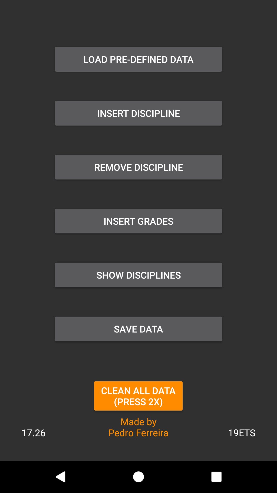

# FaculHelper
This is an android application that helps students to calculate the average of their course's subjects.
It's built in Java and aims to make it easy for students to track their grades across different subjects.

## Features
* Add subjects: Add subjects with the number of evaluations and their percentages
* Remove subject: Removes a specific subject
* Insert grades: Adds a single grade to a specific subject
* Show subjects: Shows all subjects with their final grade and credits order by the year/semester/final grade
* Clean all data: Removes every subject in the system

## Requirements
* Android device: version 8 or higher

## Screenshots

